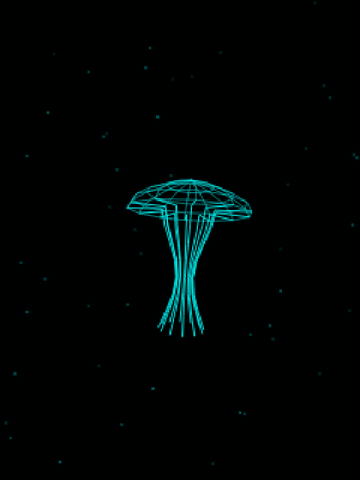

# Nausilus


Nausilus is an open-source macOS desktop companion: a small Tauri app with a gently pulsing jellyfish renderer that can be built and inspected locally.

The repo is source-first. The downloadable tester build is available for trusted testers, but it is unsigned and not notarized. Treat the source and build instructions as the primary public artifact.



[X-ready MP4 demo](docs/nausilus-demo.mp4) | [Desktop still](docs/nausilus-desktop-screenshot.png)

## Status

Current source/app version: `0.0.2`

Public posture:

- Source code is MIT licensed and intended for review, local builds, and experimentation
- Tester release is unsigned, not notarized, and Apple Silicon only
- No paid Apple Developer ID signing is configured yet
- The app currently ships one visual mode: the jellyfish renderer

Current tester build:

- [Nausilus tester v0.0.2](https://github.com/TheCountOfSaintGermain/nausilus/releases/tag/tester-v0.0.2)
- [Tester checksum](docs/release-checksums/tester-v0.0.2-SHA256SUMS.txt)

Use the release notes for tester install instructions. For public evaluation, building from source is the cleaner path.

## Local Development

Prerequisites:

- Node.js 20.19+ or 22.12+
- Rust toolchain
- Tauri prerequisites for macOS development

Install dependencies:

```bash
npm ci
```

Run the Vite frontend:

```bash
npm run dev
```

Build the frontend:

```bash
npm run build
```

Run the Tauri app locally:

```bash
npx tauri dev
```

Build an unsigned local app bundle:

```bash
npx tauri build --bundles app
```

## Controls

| Action | Result |
| --- | --- |
| Click or tap the jellyfish | Cycle color modes |
| Hold the left or right side | Gently turn the jellyfish |
| Click or tap the top-right corner | Toggle wireframe rendering |

The jellyfish animates continuously in the center of the window. The window can be resized; the canvas stays centered and scales within the app bounds.

## Features

- Smooth, continuously animated jellyfish with depth-shaded bell and tentacles
- Centered layout with responsive resize
- Color cycling and wireframe toggle
- Standalone macOS app shell through Tauri
- Manual GitHub Actions workflow for unsigned macOS build artifacts

## For AI Agents

Good entry points:

- `README.md` for current public posture and local build commands
- `docs/architecture.md` for the project structure and renderer flow
- `CREDITS.md` for upstream attribution requirements
- `.github/workflows/ci.yml` for the required verification baseline

Do not add signing, notarization, release publishing, or credential-dependent automation without explicit maintainer approval.

## Notes & Limitations

- The tester build is not a production-quality macOS distribution package
- Gatekeeper friction is expected until a paid Apple Developer ID signing path exists
- The current tester build is Apple Silicon only
- No system tray integration in this version
- No auto-updater in this version

## Credits

Nausilus credits and preserves attribution to:

- Denki Kurage by likeablob: https://github.com/likeablob/denki-kurage

Portions of the renderer are adapted from MIT-licensed Denki Kurage source concepts. See `CREDITS.md` for the third-party notice.

## License

Nausilus is released under the MIT License. See `LICENSE`.

The upstream Denki Kurage notice is preserved in `CREDITS.md`.
