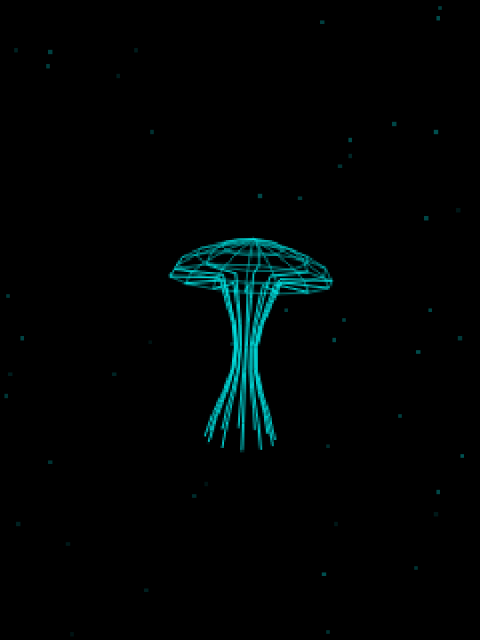

# Nausilus


Nausilus is a lightweight macOS desktop companion app featuring a gently pulsing jellyfish animation.

The current renderer is a desktop TypeScript/Tauri adaptation of ideas and geometry from [Denki Kurage](https://github.com/likeablob/denki-kurage), an ESP32/CYD jellyfish animation project by likeablob.



## Status

Nausilus is early tester software. The source is MIT licensed and public, but the current downloadable tester build is unsigned and not notarized, so it is intended for trusted testers rather than broad public installation.

Current source/app version: `0.0.2`

Current tester build:

- [Nausilus tester v0.0.2](https://github.com/TheCountOfSaintGermain/nausilus/releases/tag/tester-v0.0.2)

Use the release notes for tester install instructions.

## Local Development

Prerequisites:

- Node.js 20+
- Rust toolchain
- Tauri prerequisites for macOS development

Install dependencies:

```bash
npm install
```

Run the Vite frontend:

```bash
npm run dev
```

Build the frontend:

```bash
npm run build
```

Run the Tauri app locally:

```bash
npx tauri dev
```

## Controls

| Action | Result |
| --- | --- |
| Click or tap the jellyfish | Cycle color modes |
| Hold the left or right side | Gently turn the jellyfish |
| Click or tap the top-right corner | Toggle wireframe rendering |
| Press `Shift+D` | Toggle the development debug overlay |

The jellyfish animates continuously in the center of the window. The window can be resized; the canvas stays centered and scales within the app bounds.

## Features

- Smooth, continuously animated jellyfish with depth-shaded bell and tentacles
- Centered layout with responsive resize
- Color cycling and wireframe toggle
- Standalone macOS app shell through Tauri

## Notes & Limitations

- The app currently ships one visual mode: the jellyfish renderer
- Placeholder creature-mode scaffolding has been removed until there is a real second mode worth maintaining
- Resize limits prevent the window from becoming too small to see the animation or impractically large
- The current tester build is Apple Silicon only
- No system tray integration in this version

## Credits

Nausilus credits and preserves attribution to:

- Denki Kurage by likeablob: https://github.com/likeablob/denki-kurage

Portions of the renderer are adapted from MIT-licensed Denki Kurage source concepts. See `CREDITS.md` for the third-party notice.

## License

Nausilus is released under the MIT License. See `LICENSE`.

The upstream Denki Kurage notice is preserved in `CREDITS.md`.
